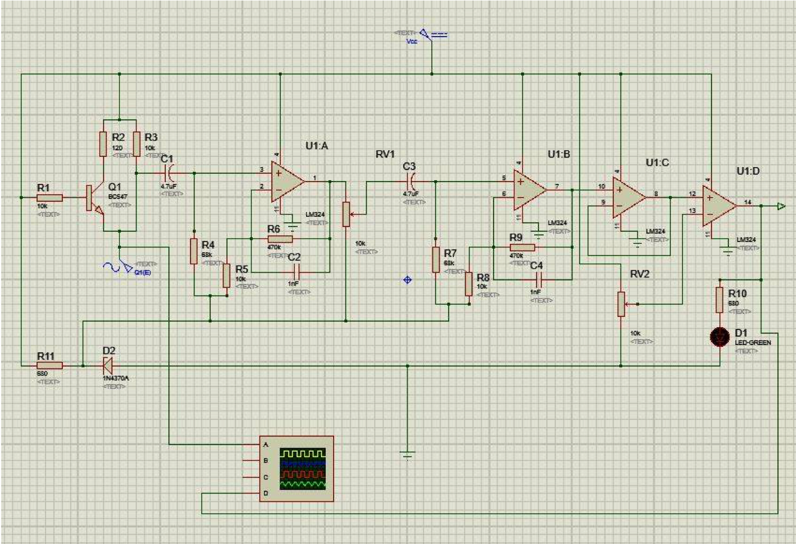
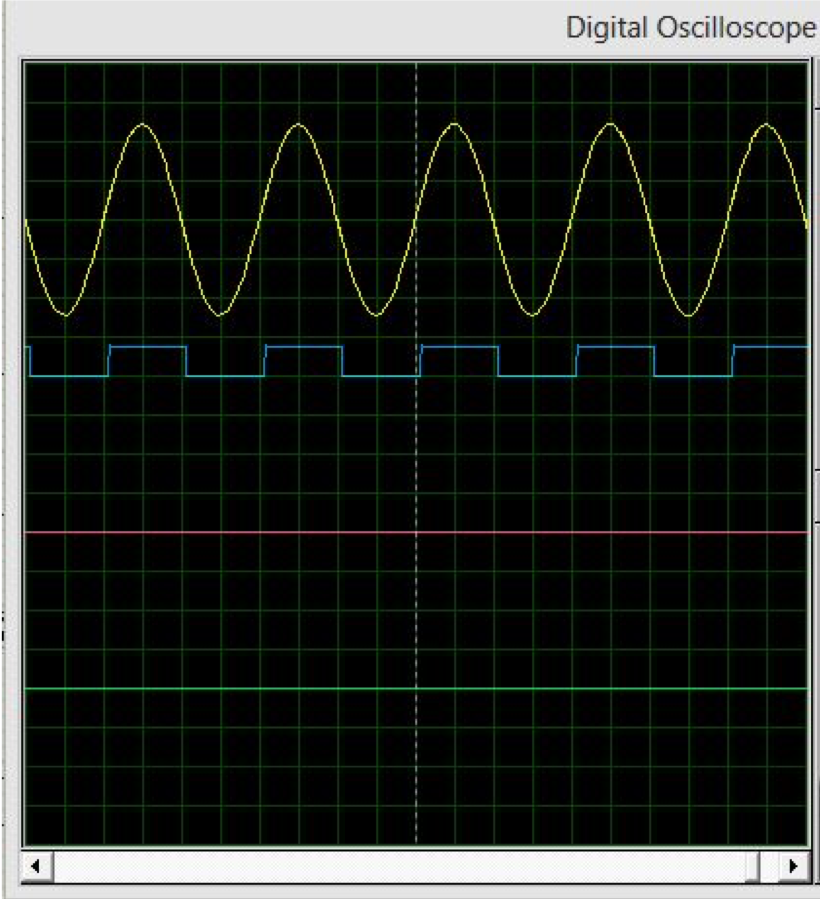
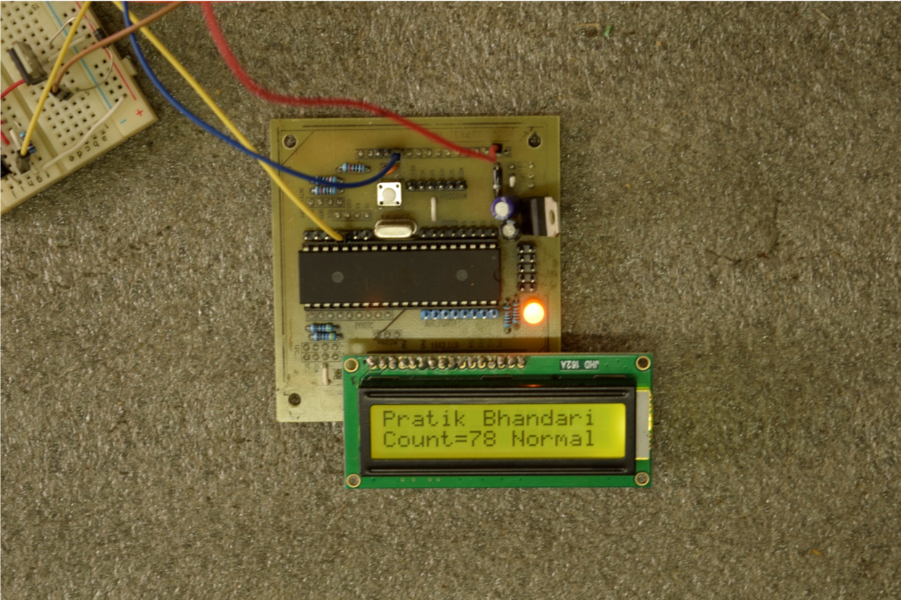
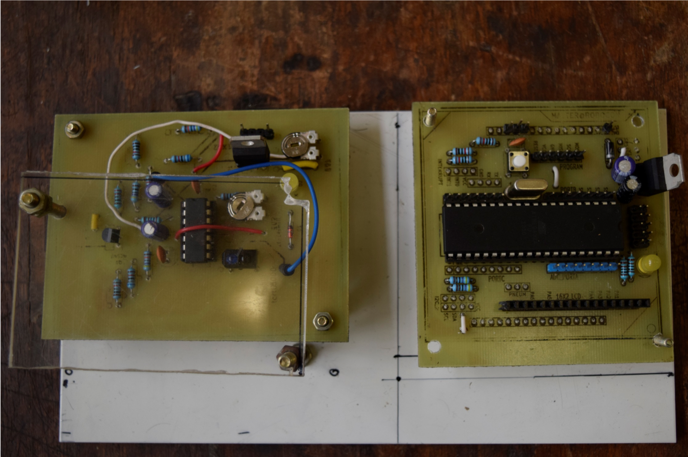

# heart-rate-detector
A simple heart rate detector implemented using an ATmega32 microcontroller and an IR sensor for sensing.
This project was done in accordance with the Minor Project requirement for my undergradaute degree.

# Documents
The `Slides.pptx` contains the presentation of the final project prototype.

# Images

